id: dt-k8s-otel-o11y-ppx
summary: opentelemetry collector log processing with dynatrace openpipeline
author: Tony Pope-Cruz

# OpenTelemetry Collector Log Processing with Dynatrace OpenPipeline
<!-- ------------------------ -->
## Overview 
Total Duration: 30 minutes

### What You’ll Learn Today
In this lab we'll utilize Dynatrace OpenPipeline to process OpenTelemetry Collector internal telemetry logs at ingest, in order to make them easier to analyze and leverage.  The OpenTelemetry Collector logs will be ingested by the OpenTelemetry Collector, deployed as a Daemonset in a previous lab.  The OpenTelemetry Collector logs are output mixed JSON/console format, making them difficult to use by default.  With OpenPipeline, the logs will be processed at ingest, to manipulate fields, extract metrics, and raise alert events in case of any issues.

Lab tasks:
1. Ingest OpenTelemetry Collector internal telemetry logs using OpenTelemetry Collector
2. Parse OpenTelemetry Collector logs using DQL in a Notebook, giving you flexibility at query time
3. Parse OpenTelemetry Collector logs at ingest using Dynatrace OpenPipeline, giving you simplicity at query time
4. Query and visualize logs and metrics in Dynatrace using DQL
5. Update the OpenTelemetry Collector self-monitoring dashboard to use the new results


<!-- -------------------------->
## Technical Specification 
Duration: 2 minutes

#### Technologies Used
- [Dynatrace](https://www.dynatrace.com/trial)
- [Google Kubernetes Engine](https://cloud.google.com/kubernetes-engine)
  - tested on GKE v1.29.4-gke.1043002
- [OpenTelemetry Collector - Dynatrace Distro](https://docs.dynatrace.com/docs/extend-dynatrace/opentelemetry/collector/deployment)
  - tested on v0.8.0
- [OpenTelemetry Collector - Contrib Distro](https://github.com/open-telemetry/opentelemetry-collector-contrib/releases/tag/v0.103.0)
  - tested on v0.103.0

#### Reference Architecture
TODO

#### Prerequisites
- Google Cloud Account
- Google Cloud Project
- Google Cloud Access to Create and Manage GKE Clusters
- Google CloudShell Access
- Dynatrace SaaS environment powered by Grail and AppEngine.
    - You have both `openpipeline:configurations:write` and `openpipeline:configurations:read` permissions.

<!-- -------------------------->
## Setup
Duration: 28 minutes

### Prerequisites

#### Deploy GKE cluster & demo assets
https://github.com/popecruzdt/dt-k8s-otel-o11y-cluster

https://github.com/popecruzdt/dt-k8s-otel-o11y-cap

#### Import Notebook into Dynatrace
[notebook](/dt-k8s-otel-o11y-ppx_dt_notebook.json)
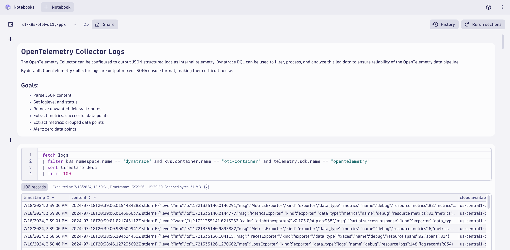

#### Import Dashboard into Dynatrace
[dashboard](/OpenTelemetry_Collector_[IsItObservable]_-_OpenPipeline_dt_dashboard.json)
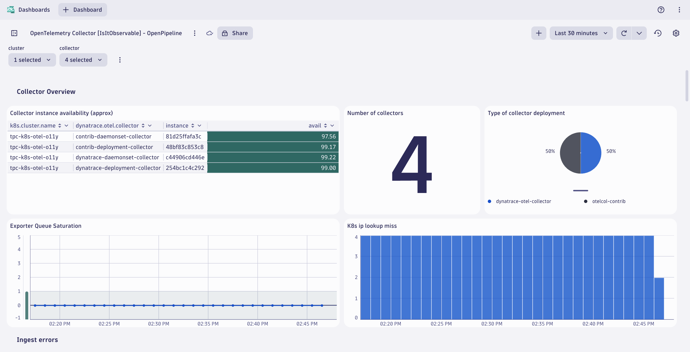

### OpenTelemetry Collector Logs - Ondemand Processing at Query Time (Notebook)

#### OpenTelemetry Collector Logs

The OpenTelemetry Collector can be configured to output JSON structured logs as internal telemetry.  Dynatrace DQL can be used to filter, process, and analyze this log data to ensure reliability of the OpenTelemetry data pipeline.

By default, OpenTelemetry Collector logs are output mixed JSON/console format, making them difficult to use.

#### Goals:
* Parse JSON content
* Set loglevel and status
* Remove unwanted fields/attributes
* Extract metrics: successful data points
* Extract metrics: dropped data points
* Alert: zero data points

##### Query logs in Dynatrace
DQL:
```sql
fetch logs
| filter k8s.namespace.name == "dynatrace" and k8s.container.name == "otc-container" and telemetry.sdk.name == "opentelemetry"
| sort timestamp desc
| limit 100
```
Result:\
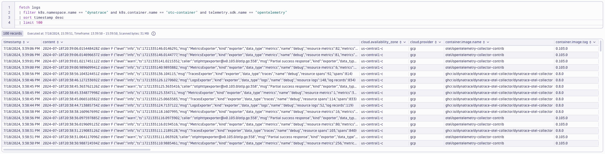

#### Parse JSON Content
https://docs.dynatrace.com/docs/platform/grail/dynatrace-query-language/commands/extraction-and-parsing-commands#parse

Parses a record field and puts the result(s) into one or more fields as specified in the pattern.  The parse command works in combination with the Dynatrace Pattern Language for parsing strings.\
https://docs.dynatrace.com/docs/platform/grail/dynatrace-pattern-language/log-processing-json-object

There are several ways how to control parsing elements from a JSON object. The easiest is to use the JSON matcher without any parameters. It will enumerate all elements, transform them into Log processing data type from their defined type in JSON and returns a variant_object with parsed elements.

The `content` field contains JSON structured details that can be parsed to better analyze relevant fields. The structured content can then be flattened for easier analysis.\
https://docs.dynatrace.com/docs/platform/grail/dynatrace-query-language/commands/structuring-commands#fieldsFlatten

##### Query logs in Dynatrace
DQL:
```sql
fetch logs
| filter k8s.namespace.name == "dynatrace" and k8s.container.name == "otc-container" and telemetry.sdk.name == "opentelemetry"
| sort timestamp desc
| limit 100
| parse content, "DATA JSON:jc"
| fieldsFlatten jc, prefix: "content."
| fields timestamp, content, jc, content.level, content.ts, content.msg, content.kind, content.data_type, content.name
```
Result:\
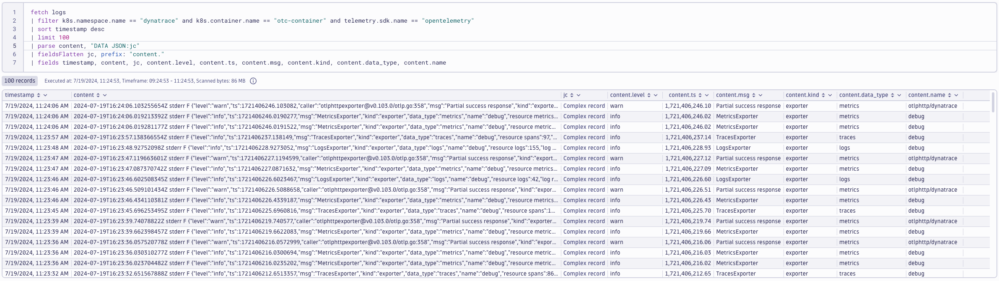

#### Set `loglevel` and `status` fields
https://docs.dynatrace.com/docs/platform/grail/dynatrace-query-language/commands/selection-and-modification-commands

The `fieldsAdd` command evaluates an expression and appends or replaces a field.

The JSON structure contains a field `level` that can be used to set the `loglevel` field.  It must be uppercase.

* loglevel possible values are: NONE, TRACE, DEBUG, NOTICE, INFO, WARN, SEVERE, ERROR, CRITICAL, ALERT, FATAL, EMERGENCY
* status field possible values are: ERROR, WARN, INFO, NONE

The `if` conditional function allows you to set a value based on a conditional expression.  Since the `status` field depends on the `loglevel` field, a nested `if` expression can be used.

https://docs.dynatrace.com/docs/platform/grail/dynatrace-query-language/functions/conditional-functions#if

##### Query logs in Dynatrace
DQL:
```sql
fetch logs
| filter k8s.namespace.name == "dynatrace" and k8s.container.name == "otc-container" and telemetry.sdk.name == "opentelemetry"
| sort timestamp desc
| limit 100
| parse content, "DATA JSON:jc"
| fieldsFlatten jc, prefix: "content."
| fieldsAdd loglevel = upper(content.level)
| fieldsAdd status = if(loglevel=="INFO","INFO",else: // most likely first
                     if(loglevel=="WARN","WARN",else: // second most likely second
                     if(loglevel=="ERROR","ERROR", else: // third most likely third
                     if(loglevel=="NONE","NONE",else: // fourth most likely fourth
                     if(loglevel=="TRACE","INFO",else:
                     if(loglevel=="DEBUG","INFO",else:
                     if(loglevel=="NOTICE","INFO",else:
                     if(loglevel=="SEVERE","ERROR",else:
                     if(loglevel=="CRITICAL","ERROR",else:
                     if(loglevel=="ALERT","ERROR",else:
                     if(loglevel=="FATAL","ERROR",else:
                     if(loglevel=="EMERGENCY","ERROR",else:
                     "NONE"))))))))))))
| fields timestamp, loglevel, status, content, content.level
```
Result:\
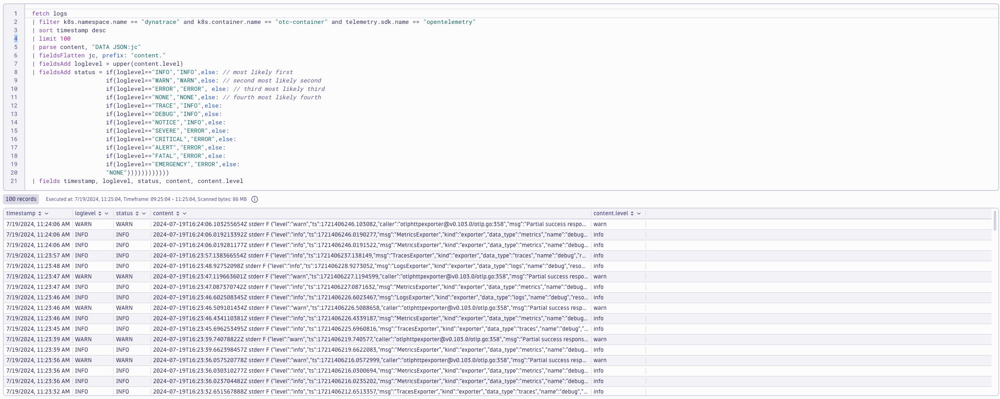

#### Remove unwanted fields/attributes

The `fieldsRemove` command will remove selected fields.\
https://docs.dynatrace.com/docs/platform/grail/dynatrace-query-language/commands/selection-and-modification-commands#fieldsRemove

After parsing and flattening the JSON structured content, the original fields should be removed.  Fields that don't add value should be removed at the source, but if they are not, they can be removed with DQL.

Every log record should ideally have a content field, as it is expected.  The `content` field can be updated with values from other fields, such as `content.msg` and `content.message`.

##### Query logs in Dynatrace
DQL:
```sql
fetch logs
| filter k8s.namespace.name == "dynatrace" and k8s.container.name == "otc-container" and telemetry.sdk.name == "opentelemetry"
| sort timestamp desc
| limit 100
| parse content, "DATA JSON:jc"
| fieldsFlatten jc, prefix: "content."
| fieldsRemove jc, content.level, content.ts, log.iostream
| fieldsAdd content = if((isNotNull(content.msg) and isNotNull(content.message)), concat(content.msg," | ",content.message), else:
                      if((isNotNull(content.msg) and isNull(content.message)), content.msg, else:
                      if((isNull(content.msg) and isNotNull(content.message)), content.message, else:
                      content)))
| fields timestamp, content, content.msg, content.message
```
Result:\
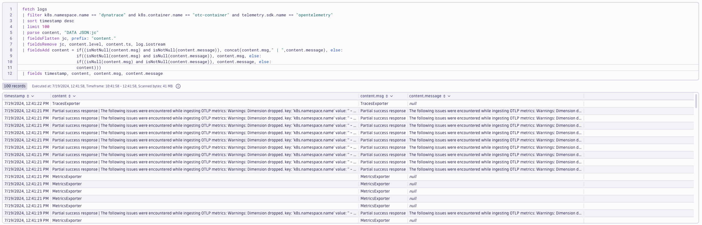

#### Extract metrics: successful data points / signals

The `summarize` command enables you to aggregate records to compute results based on counts, attribute values, and more.\
https://docs.dynatrace.com/docs/platform/grail/dynatrace-query-language/commands/aggregation-commands#summarize

The JSON structured content contains several fields that indicate the number of successful data points / signals sent by the exporter.
* logs: resource logs, log records
* metrics: resource metrics, metrics, data points
* traces: resource spans, spans

##### Query logs in Dynatrace
DQL:
```sql
fetch logs
| filter k8s.namespace.name == "dynatrace" and k8s.container.name == "otc-container" and telemetry.sdk.name == "opentelemetry"
| sort timestamp desc
| limit 100
| parse content, "DATA JSON:jc"
| fieldsFlatten jc, prefix: "content."
| filter matchesValue(`content.kind`,"exporter")
| fieldsRemove content, jc, content.level, content.ts, log.iostream
| summarize {
              resource_metrics = sum(`content.resource metrics`),
              metrics = sum(`content.metrics`),
              data_points = sum(`content.data points`),
              resource_spans = sum(`content.resource spans`),
              spans = sum(`content.spans`),
              resource_logs = sum(`content.resource logs`),
              log_records = sum(`content.log records`)
              }, by: { data_type = `content.data_type`, exporter = `content.name`, dynatrace.otel.collector, k8s.cluster.name}
```
Result:\
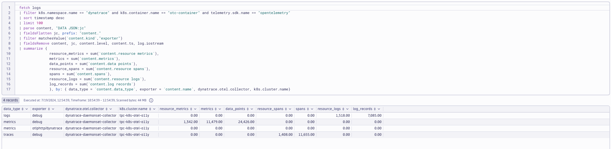

#### Extract metrics: dropped data points / signals

The JSON structured content contains several fields that indicate the number of dropped data points / signals sent by the exporter.
* dropped data points
* data type
* (exporter) name
* message (reason)

##### Query logs in Dynatrace
DQL:
```sql
fetch logs
| filter k8s.namespace.name == "dynatrace" and k8s.container.name == "otc-container" and telemetry.sdk.name == "opentelemetry"
| sort timestamp desc
| limit 100
| parse content, "DATA JSON:jc"
| fieldsFlatten jc, prefix: "content."
| filter matchesValue(`content.kind`,"exporter")
| fieldsRemove content, jc, content.level, content.ts, log.iostream
| parse content.message, "DATA 'Reason:' LD:content.reason"
| fieldsAdd content.reason = if(isNull(content.reason), "NONE", else: content.reason)
| summarize dropped_data_points = sum(`content.dropped_data_points`), by: {data_type = `content.data_type`, reason = `content.reason`, dynatrace.otel.collector, content.name}
```
Result:\
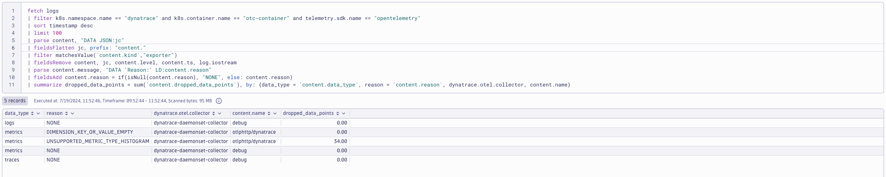

#### Alert: zero data points / signals

It would be unexpected that the collector exporter doesn't send any data points or signals.  We could alert on this unexpected behavior.

The field `content.data_type` will indicate the type of data point or signal.  The fields `content.log records`, `content.data points`, and `content.spans` will indicate the number of signals sent.  If the value is `0`, that is unexpected.

##### Query logs in Dynatrace
DQL:
```sql
fetch logs
| filter k8s.namespace.name == "dynatrace" and k8s.container.name == "otc-container" and telemetry.sdk.name == "opentelemetry"
| sort timestamp desc
| limit 100
| parse content, "DATA JSON:jc"
| fieldsFlatten jc, prefix: "content."
| filter matchesValue(content.kind,"exporter")
| summarize {
              logs = countIf(matchesValue(`content.data_type`,"logs") and matchesValue(toString(`content.log records`),"0")),
              metrics = countIf(matchesValue(`content.data_type`,"metrics") and matchesValue(toString(`content.data points`),"0")),
              traces = countIf(matchesValue(`content.data_type`,"traces") and matchesValue(toString(`content.spans`),"0"))
            }
```
Result:\
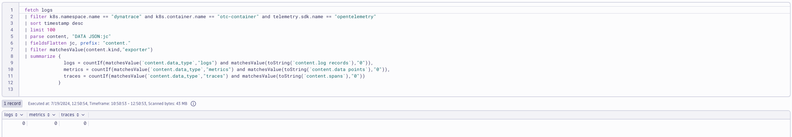

#### DQL in Notebooks Summary

DQL gives you the power to filter, parse, summarize, and analyze log data quickly and on the fly.  This is great for use cases where the format of your log data is unexpected.  However, when you know the format of your log data and you know how you will want to use that log data in the future, you'll want that data to be parsed and presented a certain way during ingest.  OpenPipeline provides the capabilites needed to accomplish this.

https://docs.dynatrace.com/docs/platform/openpipeline

### OpenTelemetry Collector Logs - Ingest Processing with OpenPipeline

https://docs.dynatrace.com/docs/platform/openpipeline/getting-started/tutorial-configure-processing

(optional) query and copy one log record to run as sample data

DQL:
```sql
fetch logs
| filter k8s.namespace.name == "dynatrace" and k8s.container.name == "otc-container" and telemetry.sdk.name == "opentelemetry"
| fieldsRemove cloud.account.id // removed for data privacy and security reasons only
| sort timestamp desc
| limit 1
```
Result:\
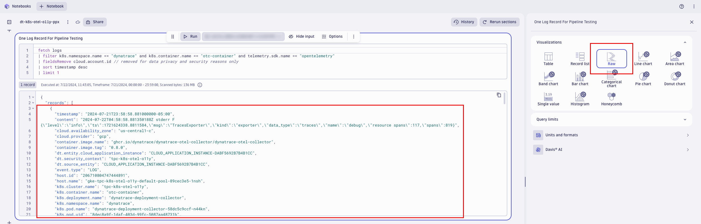

#### Add a new Logs Pipeline
Open the Dynatrace OpenPipeline management app.  Use the search function to locate it.


Create a new Logs Pipeline.
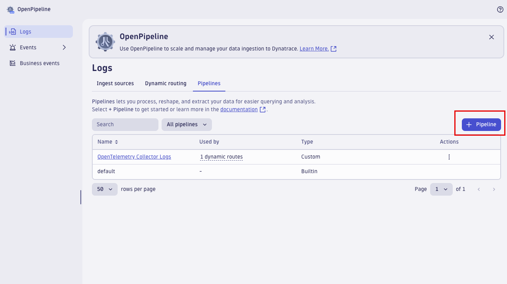

Rename the Pipeline to `OpenTelemetry Collector Logs`.
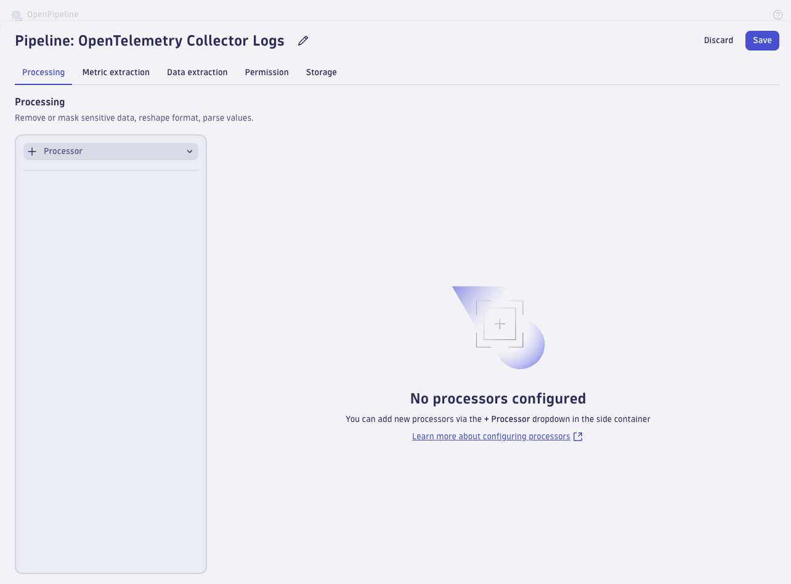

#### Add Processing rules to Pipeline
Create a `DQL` processor called `Parse JSON Content`.
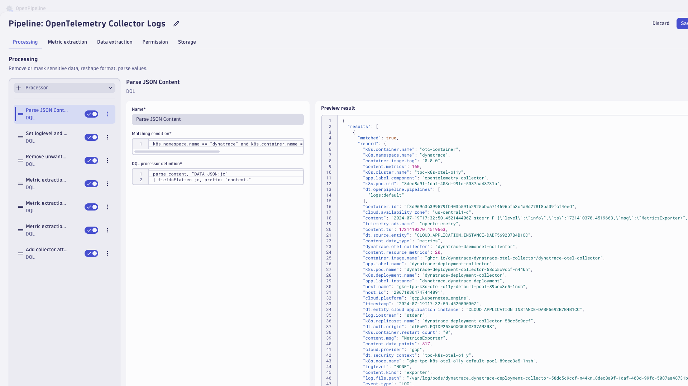

Name:
```
Parse JSON Content
```

Matching condition:
```
k8s.namespace.name == "dynatrace" and k8s.container.name == "otc-container" and telemetry.sdk.name == "opentelemetry"
```

DQL processor definition
```
parse content, "DATA JSON:jc"
| fieldsFlatten jc, prefix: "content."
```

Create a `DQL` processor called `Set loglevel and status fields`.
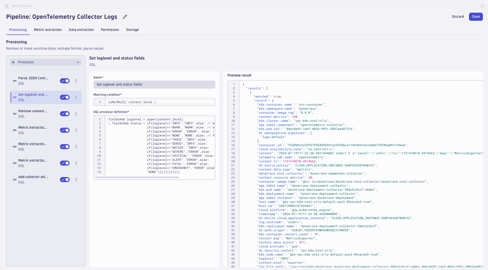

Name:
```
Set loglevel and status fields
```

Matching condition:
```
isNotNull(`content.level`)
```

DQL processor definition
```
fieldsAdd loglevel = upper(content.level)
| fieldsAdd status = if(loglevel=="INFO","INFO",else: // most likely first
                     if(loglevel=="WARN","WARN",else: // second most likely second
                     if(loglevel=="ERROR","ERROR", else: // third most likely third
                     if(loglevel=="NONE","NONE",else: // fourth most likely fourth
                     if(loglevel=="TRACE","INFO",else:
                     if(loglevel=="DEBUG","INFO",else:
                     if(loglevel=="NOTICE","INFO",else:
                     if(loglevel=="SEVERE","ERROR",else:
                     if(loglevel=="CRITICAL","ERROR",else:
                     if(loglevel=="ALERT","ERROR",else:
                     if(loglevel=="FATAL","ERROR",else:
                     if(loglevel=="EMERGENCY","ERROR",else:
                     "NONE"))))))))))))
```

Create a `DQL` processor called `Remove unwanted fields/attributes`.
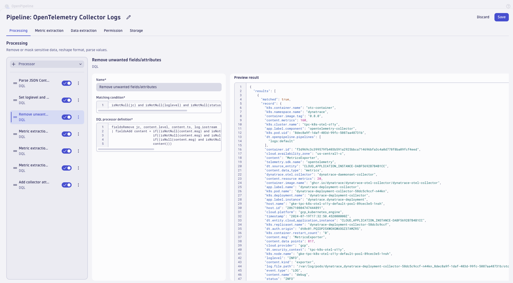

Name:
```
Remove unwanted fields/attributes
```

Matching condition:
```
isNotNull(jc) and isNotNull(loglevel) and isNotNull(status) and loglevel!="NONE"
```

DQL processor definition
```
fieldsRemove jc, content.level, content.ts, log.iostream
| fieldsAdd content = if((isNotNull(content.msg) and isNotNull(content.message)), concat(content.msg," | ",content.message), else:
                      if((isNotNull(content.msg) and isNull(content.message)), content.msg, else:
                      if((isNull(content.msg) and isNotNull(content.message)), content.message, else:
                      content)))
```

Create a `DQL` processor called `Metric extraction - remove spaces from fields - metrics`.
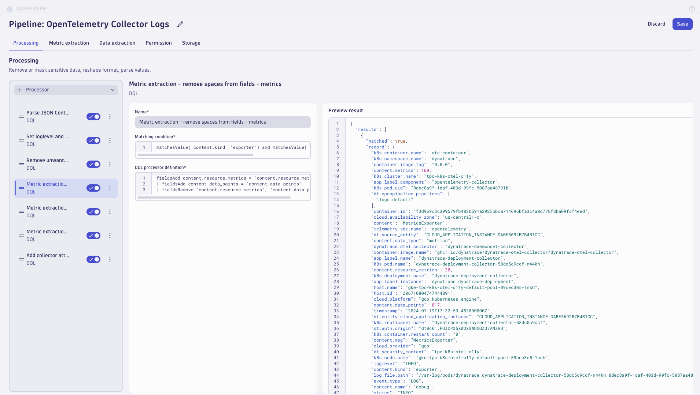

Name:
```
Metric extraction - remove spaces from fields - metrics
```

Matching condition:
```
matchesValue(`content.kind`,"exporter") and matchesValue(`content.data_type`,"metrics")
```

DQL processor definition
```
fieldsAdd content.resource_metrics = `content.resource metrics`
| fieldsAdd content.data_points = `content.data points`
| fieldsRemove `content.resource metrics`, `content.data points`
```

Create a `DQL` processor called `Metric extraction - remove spaces from fields - logs`.
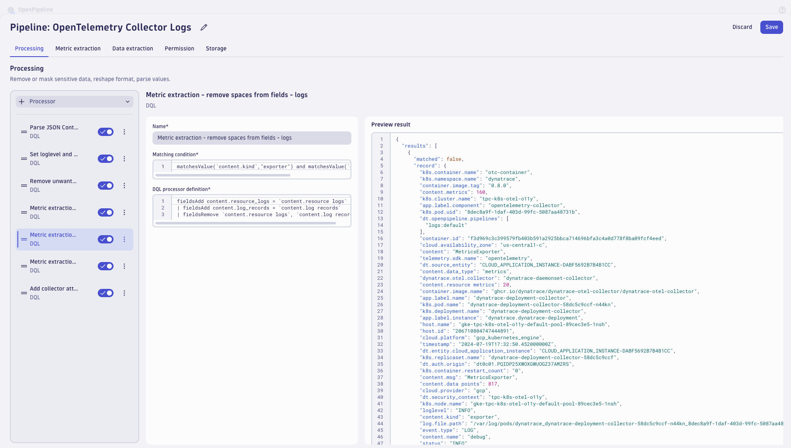

Name:
```
Metric extraction - remove spaces from fields - logs
```

Matching condition:
```
matchesValue(`content.kind`,"exporter") and matchesValue(`content.data_type`,"logs")
```

DQL processor definition
```
fieldsAdd content.resource_logs = `content.resource logs`
| fieldsAdd content.log_records = `content.log records`
| fieldsRemove `content.resource logs`, `content.log records`
```

Create a `DQL` processor called `Metric extraction - remove spaces from fields - traces`.
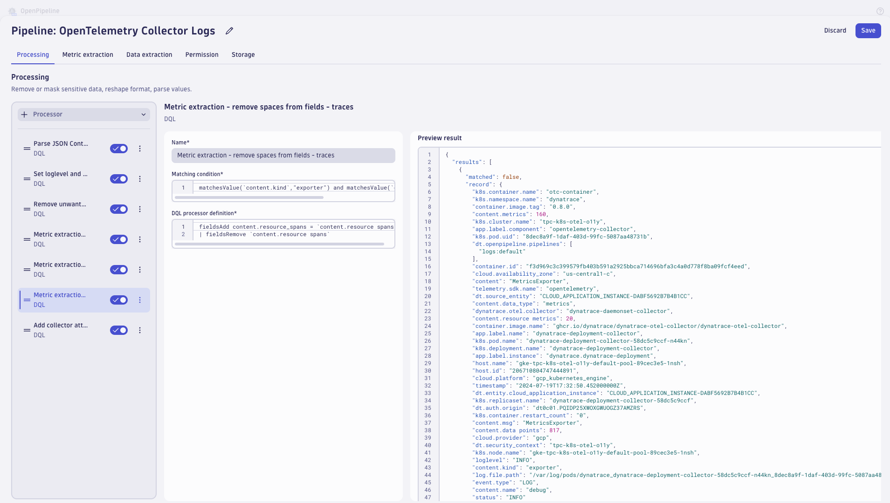

Name:
```
Metric extraction - remove spaces from fields - traces
```

Matching condition:
```
matchesValue(`content.kind`,"exporter") and matchesValue(`content.data_type`,"traces")
```

DQL processor definition
```
fieldsAdd content.resource_spans = `content.resource spans`
| fieldsRemove `content.resource spans`
```

Create a `DQL` processor called `Add collector attribute from app.label.name`.
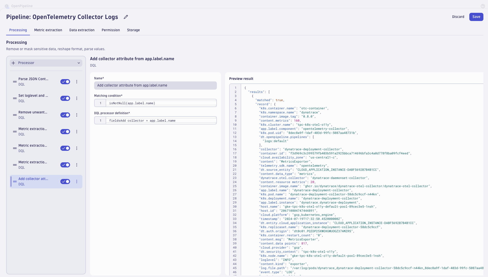

Name:
```
Add collector attribute from app.label.name
```

Matching condition:
```
isNotNull(app.label.name)
```

DQL processor definition
```
fieldsAdd collector = app.label.name
```

##### ***
##### STOP! Consider saving your Pipeline now to avoid accidentally losing your progress!
##### ***

#### Add Metric extraction rules to Pipeline
Create a `Value metric` processor called `Successful data points - metrics`.
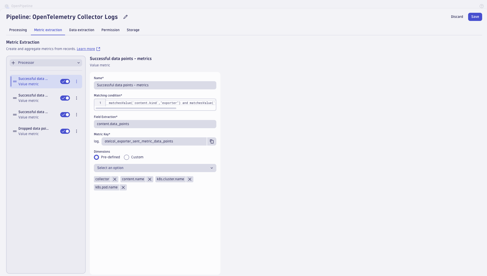

Name:
```
Successful data points - metrics
```

Matching condition:
```
matchesValue(`content.kind`,"exporter") and matchesValue(`content.data_type`,"metrics")
```

Field Extraction:
```
content.data_points
```

Metric Key:
```
otelcol_exporter_sent_metric_data_points
```

Dimensions:
```
collector
content.name
k8s.cluster.name
k8s.pod.name
```

Create a `Value metric` processor called `Successful data points - logs`.
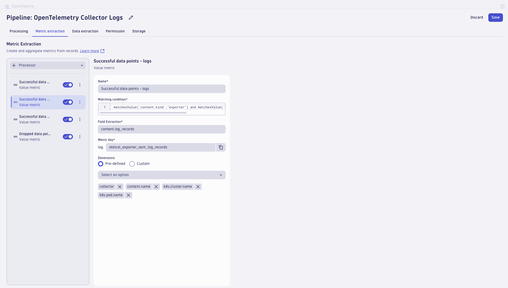

Name:
```
Successful data points - logs
```

Matching condition:
```
matchesValue(`content.kind`,"exporter") and matchesValue(`content.data_type`,"logs")
```

Field Extraction:
```
content.log_records
```

Metric Key:
```
otelcol_exporter_sent_log_records
```

Dimensions:
```
collector
content.name
k8s.cluster.name
k8s.pod.name
```

Create a `Value metric` processor called `Successful data points - traces`.
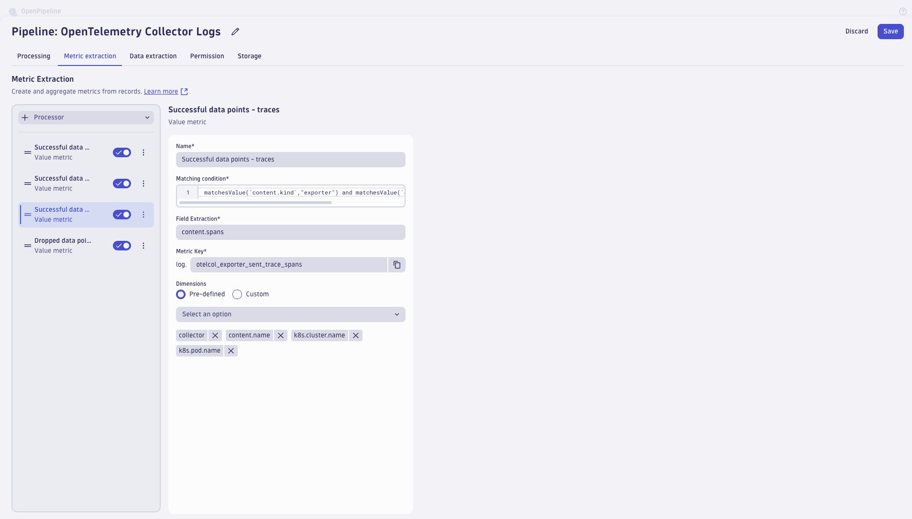

Name:
```
Successful data points - traces
```

Matching condition:
```
matchesValue(`content.kind`,"exporter") and matchesValue(`content.data_type`,"traces")
```

Field Extraction:
```
content.spans
```

Metric Key:
```
otelcol_exporter_sent_trace_spans
```

Dimensions:
```
collector
content.name
k8s.cluster.name
k8s.pod.name
```

Create a `Value metric` processor called `Dropped data points`.
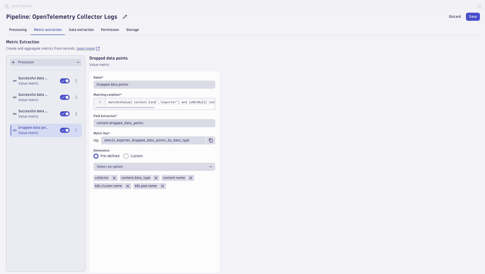

Name:
```
Dropped data points
```

Matching condition:
```
matchesValue(`content.kind`,"exporter") and isNotNull(`content.dropped_data_points`) and isNotNull(`content.data_type`)
```

Field Extraction:
```
content.dropped_data_points
```

Metric Key:
```
otelcol_exporter_dropped_data_points_by_data_type
```

Dimensions:
```
collector
content.data_type
content.name
k8s.cluster.name
k8s.pod.name
```

##### ***
##### STOP! Consider saving your Pipeline now to avoid accidentally losing your progress!
##### ***

#### Add Data extraction rules to Pipeline
Create a `Davis event` processor called `Zero data points / signals - metrics`.
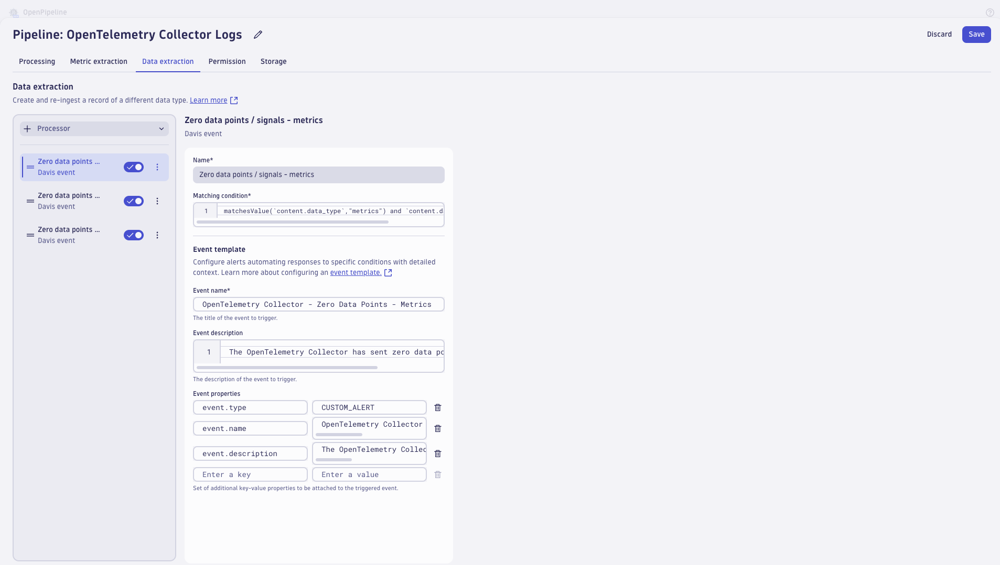

Name:
```
Zero data points / signals - metrics
```

Matching condition:
```
matchesValue(`content.data_type`,"metrics") and `content.data_points` == 0
```

Event Name:
```
OpenTelemetry Collector - Zero Data Points - Metrics
```

Event description:
```
The OpenTelemetry Collector has sent zero data points for metrics.
```

Create a `Davis event` processor called `Zero data points / signals - logs`.
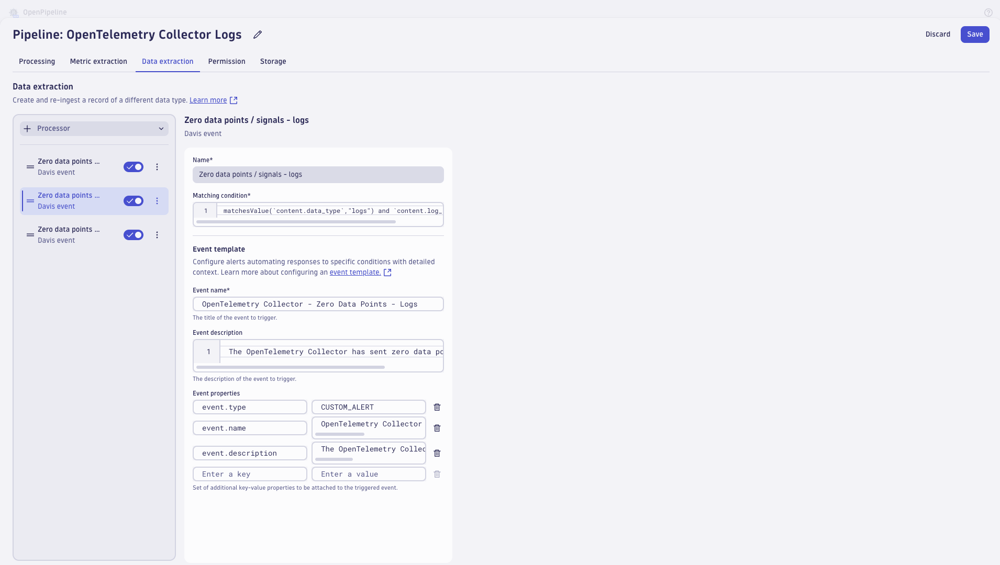

Name:
```
Zero data points / signals - logs
```

Matching condition:
```
matchesValue(`content.data_type`,"logs") and `content.log_records` == 0
```

Event Name:
```
OpenTelemetry Collector - Zero Data Points - Logs
```

Event description:
```
The OpenTelemetry Collector has sent zero data points for logs.
```

Create a `Davis event` processor called `Zero data points / signals - traces`.
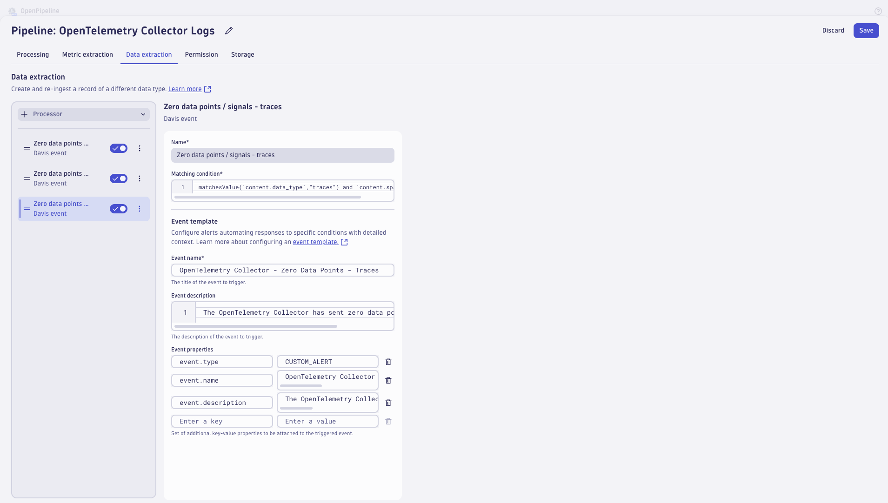

Name:
```
Zero data points / signals - traces
```

Matching condition:
```
matchesValue(`content.data_type`,"traces") and `content.spans` == 0
```

Event Name:
```
OpenTelemetry Collector - Zero Data Points - Traces
```

Event description:
```
The OpenTelemetry Collector has sent zero data points for traces.
```

##### ***
##### STOP! Consider saving your Pipeline now to avoid accidentally losing your progress!
##### ***

#### (optional) Add Permission rules to Pipeline
The `dt.security_context` attribute is already set for these logs by the OpenTelemetry Collector source.  Add a processor rule if desired.
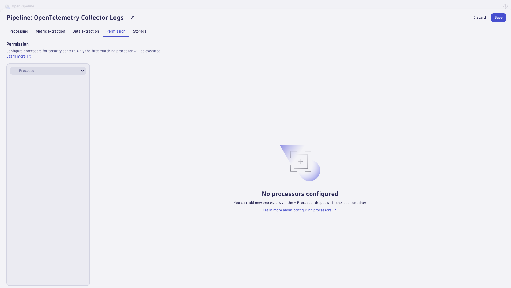
Read more details on the use of security context in the Dynatrace documentation.\
https://docs.dynatrace.com/docs/observe-and-explore/logs/lma-security-context

#### (optional) Add/Modify Storage rules to Pipeline
By default, the logs are stored in the default bucket.  Add a processor rule if desired.
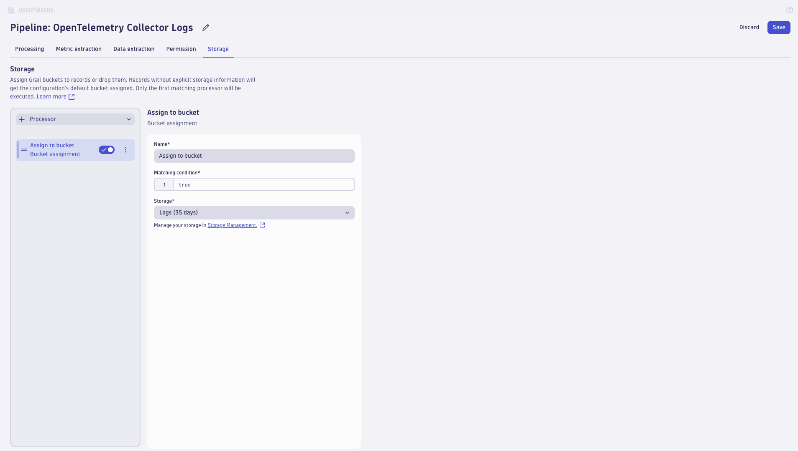
Read more details on the use of Grail storage buckets in the Dynatrace documentation.\
https://docs.dynatrace.com/docs/platform/grail/data-model

#### Save your Pipeline
Click Save.

#### Add a new Dynamic Route
Create a new Dynamic Route.
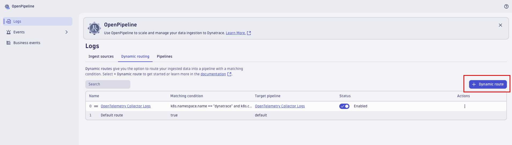

Rename the Dynamic Route to `OpenTelemetry Collector Logs`.  Apply the matching condition.  Set the Target pipeline to `OpenTelemetry Collector Logs`.
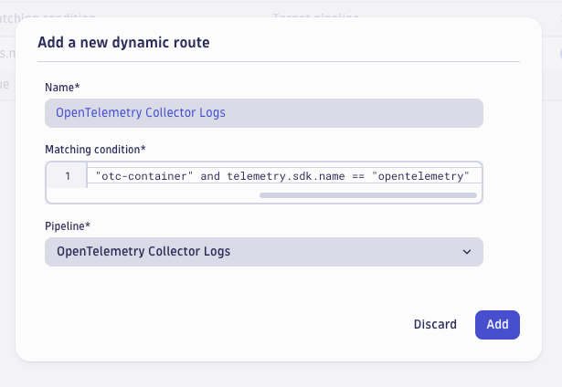

Matching condition:
```
k8s.namespace.name == "dynatrace" and k8s.container.name == "otc-container" and telemetry.sdk.name == "opentelemetry"
```

Save the configuration of Dynamic Routes.
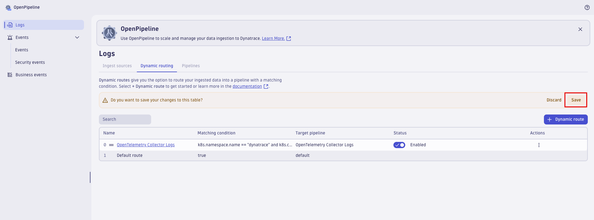

### Analyze the results in Dynatrace

Wait 2-3 minutes for new log data to be ingested and processed by Dynatrace OpenPipeline.

#### OpenPipeline Processing Results
DQL:
```sql
fetch logs
| filter k8s.namespace.name == "dynatrace" and k8s.container.name == "otc-container" and telemetry.sdk.name == "opentelemetry"
| fieldsRemove cloud.account.id // removed for data privacy and security reasons only
| sort timestamp desc
| limit 50
| fields timestamp, collector, k8s.cluster.name, loglevel, status, content.kind, content.name, content.msg, content.message, content.data_points, content.dropped_data_points
```
Result:\
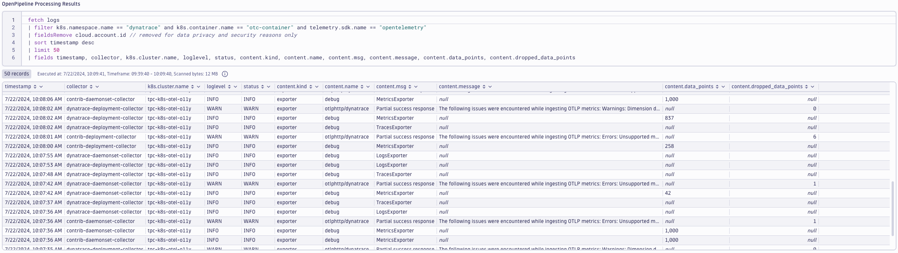

The logs are now parsed at ingest into a format that simplifies our queries and makes them easier to use, especially for users that don't work with these log sources or Dynatrace DQL on a regular basis.

#### Extracted metrics: successful data points / signals
DQL:
```sql
timeseries {
            metrics = sum(log.otelcol_exporter_sent_metric_data_points),
            logs = sum(log.otelcol_exporter_sent_log_records),
            traces = sum(log.otelcol_exporter_sent_trace_spans)
            }, by: {k8s.cluster.name, collector, exporter = content.name}
```
Result:\
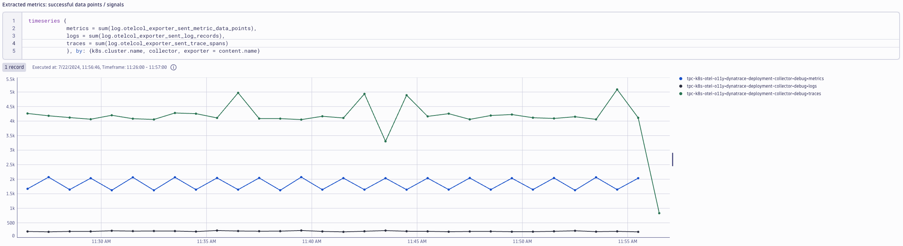

By extracting the metric(s) at ingest time, the data points are stored long term and can easily be used in dashboards, anomaly detection, and automations.

https://docs.dynatrace.com/docs/platform/openpipeline/use-cases/tutorial-log-processing-pipeline

#### Extracted metrics: successful data points / signals
DQL:
```sql
timeseries {
            dropped_data_points = sum(log.otelcol_exporter_dropped_data_points_by_data_type)
           }, by: {k8s.cluster.name, collector, exporter = content.name}
```
Result:\
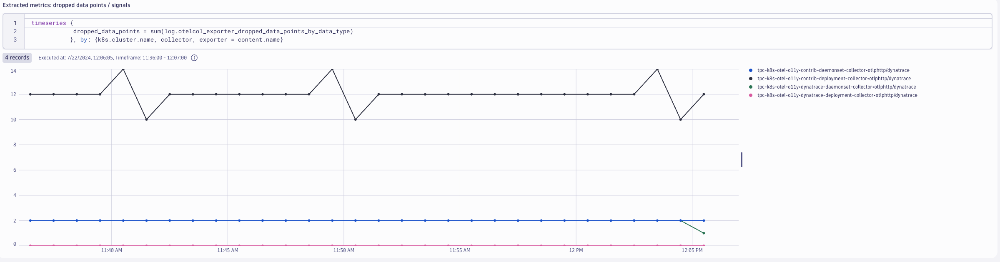

### Update OpenTelemetry Collector Dashboard

Open the new Dynatrace Dashboard that leverages the OpenPipeline processing.  Inspect the chart `Number of records dropped by OTLP ingest API` which previously queried the raw log data and now uses the new metric `log.otelcol_exporter_dropped_data_points_by_data_type` that was extracted during data ingest.
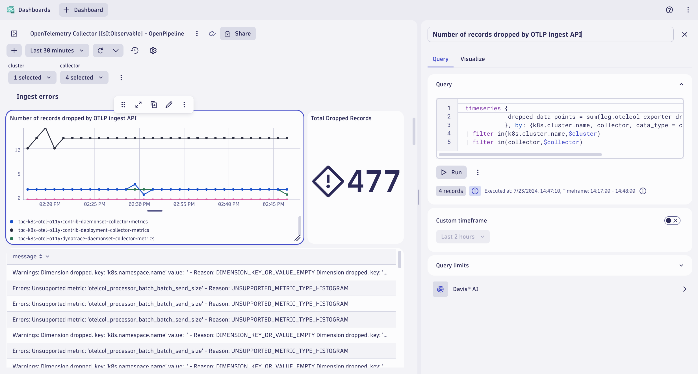

<!-- ------------------------ -->
## Demo The New Functionality
TODO

<!-- -------------------------->
## Wrap Up

### What You Learned Today 
By completing this lab, you've successfully set up a Dynatrace OpenPipeline pipeline to process the OpenTelemetry Collector logs at ingest.
- Ingest OpenTelemetry Collector internal telemetry logs using OpenTelemetry Collector
- Parse OpenTelemetry Collector logs using DQL in a Notebook, giving you flexibility at query time
    - Parse JSON structured content for usability
    - Modify loglevel and status fields
    - Remove unwanted fields
    - Extract metric data points
    - Identify alert scenarios
- Parse OpenTelemetry Collector logs at ingest using Dynatrace OpenPipeline, giving you simplicity at query time
    - Processing rules to parse and modify log attributes
    - Metric extraction to generate timeseries data
    - Event extraction to generate alerts for unexpected behaviors
- Query and visualize logs and metrics in Dynatrace using DQL
- Update the OpenTelemetry Collector self-monitoring dashboard to use the new results

<!-- ------------------------ -->
### Supplemental Material
TODO

