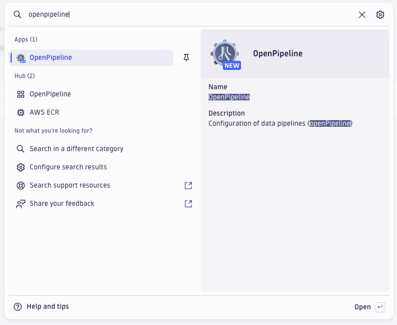

id: dt-k8s-otel-o11y-ppx
summary: opentelemetry collector log processing with dynatrace openpipeline
author: Tony Pope-Cruz

# OpenTelemetry Collector Log Processing with Dynatrace OpenPipeline
<!-- ------------------------ -->
## Overview 
Total Duration: 20

### What You’ll Learn Today
In this lab we'll utilize the OpenTelemetry Collector deployed as a DaemonSet (Node Agent) to collect pod/container logs from a Kubernetes cluster and ship them to Dynatrace.  Additionally, we'll deploy the OpenTelemetry Collector as a Deployment (Gateway) to watch Kubernetes Events from the Cluster and ship them to Dynatrace.

Lab tasks:
1. Create a Kubernetes cluster on Google GKE
2. Deploy OpenTelemetry's demo application, astronomy-shop
3. Deploy OpenTelemetry Collector as a DaemonSet
4. Deploy OpenTelemetry Collector as a Deployment
5. Configure OpenTelemetry Collector service pipeline for log enrichment
6. Query and visualize logs in Dynatrace using DQL


<!-- -------------------------->
## Technical Specification 
Duration: 2

#### Technologies Used
- [Dynatrace](https://www.dynatrace.com/trial)
- [Google Kubernetes Engine](https://cloud.google.com/kubernetes-engine)
  - tested on GKE v1.29.4-gke.1043002
- [OpenTelemetry Demo astronomy-shop](https://opentelemetry.io/docs/demo/)
  - tested on release 1.10.0, helm chart release 0.31.0
- [Istio](https://istio.io/latest/docs/)
  - tested on v1.22.1
- [OpenTelemetry Collector - Dynatrace Distro](https://docs.dynatrace.com/docs/extend-dynatrace/opentelemetry/collector/deployment)
  - tested on v0.8.0
- [OpenTelemetry Collector - Contrib Distro](https://github.com/open-telemetry/opentelemetry-collector-contrib/releases/tag/v0.103.0)
  - tested on v0.103.0

#### Reference Architecture
TODO

#### Prerequisites
- Google Cloud Account
- Google Cloud Project
- Google Cloud Access to Create and Manage GKE Clusters
- Google CloudShell Access

<!-- -------------------------->
## Setup
Duration: 18

### Prerequisites

#### Deploy GKE cluster & demo assets
https://github.com/popecruzdt/dt-k8s-otel-o11y-cluster\
https://github.com/popecruzdt/dt-k8s-otel-o11y-cap

#### Import Notebook into Dynatrace
[notebook](/dt-k8s-otel-o11y-logs_dt_notebook.json)

#### Import Dashboard into Dynatrace

### OpenTelemetry Collector Logs - Ondemand Processing at Query Time (Notebook)

### OpenTelemetry Collector Logs - Ingest Processing with OpenPipeline

#### Add a new Logs Pipeline
Open the Dynatrace OpenPipeline management app.  Use the search function to locate it.


Create a new Logs Pipeline.


Rename the Pipeline to `OpenTelemetry Collector Logs`.


#### Add Processing rules to Pipeline
Create a `DQL` processor called `Parse JSON Content`.


Name:
```
Parse JSON Content
```

Matching condition:
```
k8s.namespace.name == "dynatrace" and k8s.container.name == "otc-container" and telemetry.sdk.name == "opentelemetry"
```

DQL processor definition
```
parse content, "DATA JSON:jc"
| fieldsFlatten jc, prefix: "content."
```

Create a `DQL` processor called `Set loglevel and status fields`.


Name:
```
Set loglevel and status fields
```

Matching condition:
```
isNotNull(`content.level`)
```

DQL processor definition
```
fieldsAdd loglevel = upper(content.level)
| fieldsAdd status = if(loglevel=="INFO","INFO",else: // most likely first
                     if(loglevel=="WARN","WARN",else: // second most likely second
                     if(loglevel=="ERROR","ERROR", else: // third most likely third
                     if(loglevel=="NONE","NONE",else: // fourth most likely fourth
                     if(loglevel=="TRACE","INFO",else:
                     if(loglevel=="DEBUG","INFO",else:
                     if(loglevel=="NOTICE","INFO",else:
                     if(loglevel=="SEVERE","ERROR",else:
                     if(loglevel=="CRITICAL","ERROR",else:
                     if(loglevel=="ALERT","ERROR",else:
                     if(loglevel=="FATAL","ERROR",else:
                     if(loglevel=="EMERGENCY","ERROR",else:
                     "NONE"))))))))))))
```

Create a `DQL` processor called `Remove unwanted fields/attributes`.


Name:
```
Remove unwanted fields/attributes
```

Matching condition:
```
isNotNull(jc) and isNotNull(loglevel) and isNotNull(status) and loglevel!="NONE"
```

DQL processor definition
```
fieldsRemove jc, content.level, content.ts, log.iostream
| fieldsAdd content = if((isNotNull(content.msg) and isNotNull(content.message)), concat(content.msg," | ",content.message), else:
                      if((isNotNull(content.msg) and isNull(content.message)), content.msg, else:
                      if((isNull(content.msg) and isNotNull(content.message)), content.message, else:
                      content)))
```

Create a `DQL` processor called `Metric extraction - remove spaces from fields - metrics`.


Name:
```
Metric extraction - remove spaces from fields - metrics
```

Matching condition:
```
matchesValue(`content.kind`,"exporter") and matchesValue(`content.data_type`,"metrics")
```

DQL processor definition
```
fieldsAdd content.resource_metrics = `content.resource metrics`
| fieldsAdd content.data_points = `content.data points`
| fieldsRemove `content.resource metrics`, `content.data points`
```

Create a `DQL` processor called `Metric extraction - remove spaces from fields - logs`.


Name:
```
Metric extraction - remove spaces from fields - logs
```

Matching condition:
```
matchesValue(`content.kind`,"exporter") and matchesValue(`content.data_type`,"logs")
```

DQL processor definition
```
fieldsAdd content.resource_logs = `content.resource logs`
| fieldsAdd content.log_records = `content.log records`
| fieldsRemove `content.resource logs`, `content.log records`
```

Create a `DQL` processor called `Metric extraction - remove spaces from fields - traces`.


Name:
```
Metric extraction - remove spaces from fields - traces
```

Matching condition:
```
matchesValue(`content.kind`,"exporter") and matchesValue(`content.data_type`,"traces")
```

DQL processor definition
```
fieldsAdd content.resource_spans = `content.resource spans`
| fieldsRemove `content.resource spans`
```

Create a `DQL` processor called `Add collector attribute from app.label.name`.


Name:
```
Add collector attribute from app.label.name
```

Matching condition:
```
isNotNull(app.label.name)
```

DQL processor definition
```
fieldsAdd collector = app.label.name
```

##### ***
##### STOP! Consider saving your Pipeline now to avoid accidentally losing your progress!
##### ***

#### Add Metric extraction rules to Pipeline
Create a `Value metric` processor called `Successful data points - metrics`.


Name:
```
Successful data points - metrics
```

Matching condition:
```
matchesValue(`content.kind`,"exporter") and matchesValue(`content.data_type`,"metrics")
```

Field Extraction:
```
content.data_points
```

Metric Key:
```
otelcol_exporter_sent_metric_data_points
```

Dimensions:
```
collector
content.name
k8s.cluster.name
k8s.pod.name
```

Create a `Value metric` processor called `Successful data points - logs`.


Name:
```
Successful data points - logs
```

Matching condition:
```
matchesValue(`content.kind`,"exporter") and matchesValue(`content.data_type`,"logs")
```

Field Extraction:
```
content.log_records
```

Metric Key:
```
otelcol_exporter_sent_log_records
```

Dimensions:
```
collector
content.name
k8s.cluster.name
k8s.pod.name
```

Create a `Value metric` processor called `Successful data points - traces`.


Name:
```
Successful data points - traces
```

Matching condition:
```
matchesValue(`content.kind`,"exporter") and matchesValue(`content.data_type`,"traces")
```

Field Extraction:
```
content.spans
```

Metric Key:
```
otelcol_exporter_sent_trace_spans
```

Dimensions:
```
collector
content.name
k8s.cluster.name
k8s.pod.name
```

Create a `Value metric` processor called `Dropped data points`.


Name:
```
Dropped data points
```

Matching condition:
```
matchesValue(`content.kind`,"exporter") and isNotNull(`content.dropped_data_points`) and isNotNull(`content.data_type`)
```

Field Extraction:
```
content.dropped_data_points
```

Metric Key:
```
otelcol_exporter_dropped_data_points_by_data_type
```

Dimensions:
```
collector
content.data_type
content.name
k8s.cluster.name
k8s.pod.name
```

##### ***
##### STOP! Consider saving your Pipeline now to avoid accidentally losing your progress!
##### ***

#### Add Data extraction rules to Pipeline
Create a `Davis event` processor called `Zero data points / signals - metrics`.


Name:
```
Zero data points / signals - metrics
```

Matching condition:
```
matchesValue(`content.data_type`,"metrics") and `content.data_points` == 0
```

Event Name:
```
OpenTelemetry Collector - Zero Data Points - Metrics
```

Event description:
```
The OpenTelemetry Collector has sent zero data points for metrics.
```

Create a `Davis event` processor called `Zero data points / signals - logs`.


Name:
```
Zero data points / signals - logs
```

Matching condition:
```
matchesValue(`content.data_type`,"logs") and `content.log_records` == 0
```

Event Name:
```
OpenTelemetry Collector - Zero Data Points - Logs
```

Event description:
```
The OpenTelemetry Collector has sent zero data points for logs.
```

Create a `Davis event` processor called `Zero data points / signals - traces`.


Name:
```
Zero data points / signals - traces
```

Matching condition:
```
matchesValue(`content.data_type`,"traces") and `content.spans` == 0
```

Event Name:
```
OpenTelemetry Collector - Zero Data Points - Traces
```

Event description:
```
The OpenTelemetry Collector has sent zero data points for traces.
```

##### ***
##### STOP! Consider saving your Pipeline now to avoid accidentally losing your progress!
##### ***

#### (optional) Add Permission rules to Pipeline
The `dt.security_context` attribute is already set for these logs by the OpenTelemetry Collector source.  Add a processor rule if desired.

Read more details on the use of security context in the Dynatrace documentation.\
https://docs.dynatrace.com/docs/observe-and-explore/logs/lma-security-context

#### (optional) Add/Modify Storage rules to Pipeline
By default, the logs are stored in the default bucket.  Add a processor rule if desired.

Read more details on the use of Grail storage buckets in the Dynatrace documentation.\
https://docs.dynatrace.com/docs/platform/grail/data-model

#### Save your Pipeline
Click Save.

#### Add a new Dynamic Route
Create a new Dynamic Route.


Rename the Dynamic Route to `OpenTelemetry Collector Logs`.  Apply the matching condition.  Set the Target pipeline to `OpenTelemetry Collector Logs`.


Matching condition:
```
k8s.namespace.name == "dynatrace" and k8s.container.name == "otc-container" and telemetry.sdk.name == "opentelemetry"
```

Save the configuration of Dynamic Routes.


<!-- ------------------------ -->
## Demo The New Functionality
TODO

<!-- -------------------------->
## Wrap Up

### What You Learned Today 
By completing this lab, you've successfully deployed the OpenTelemetry Collector to collect logs, enrich log attributes for better context, and ship those logs to Dynatrace for analysis.
- The OpenTelemetry Collector was deployed as a DaemonSet, behaving as an Agent running on each Node
- The Dynatrace Distro of OpenTelemetry Collector includes supported modules needed to ship logs to Dynatrace
  - The `filelog` receiver scrapes logs from the Node filesystem and parses the contents
  - The `k8sattributes` processor enriches the logs with Kubernetes attributes
  - The `resourcedetection` processor enriches the logs with cloud and cluster (GCP/GKE) attributes
  - The `resource` processor enriches the logs with custom (resource) attributes
- The Community Contrib Distro of OpenTelemetry Collector includes modules needed to ship events to Dynatrace
  - The `k8sobjects` receiver watches for Kubernetes events (and other resources) on the cluster
- Dynatrace DQL (via Notebooks) allows you to perform powerful queries and analysis of the log data

<!-- ------------------------ -->
### Supplemental Material
TODO

